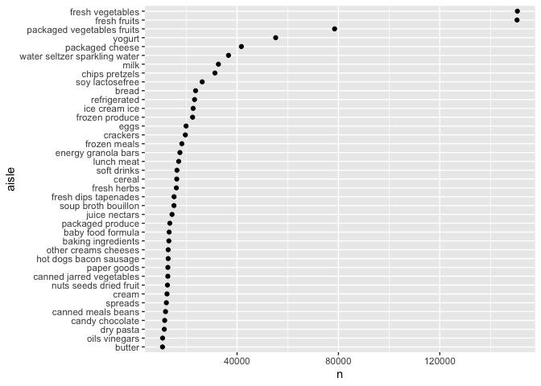
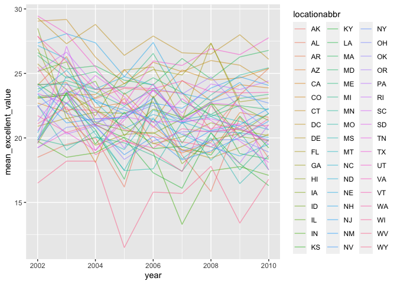
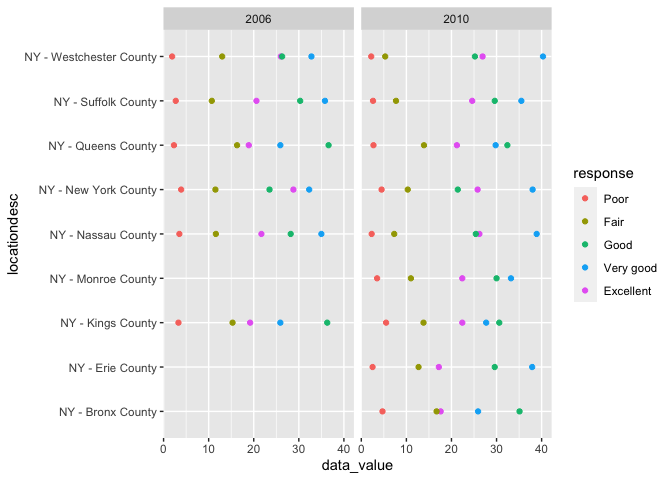
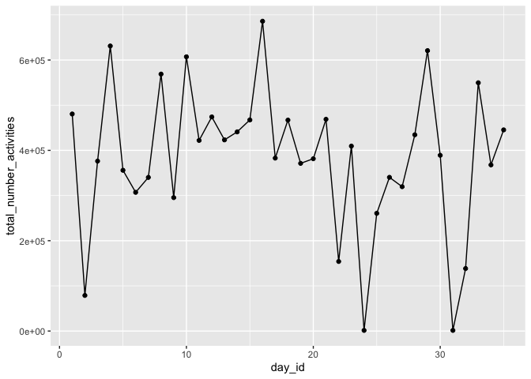
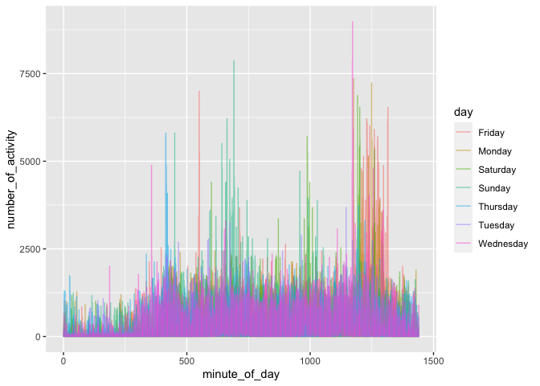
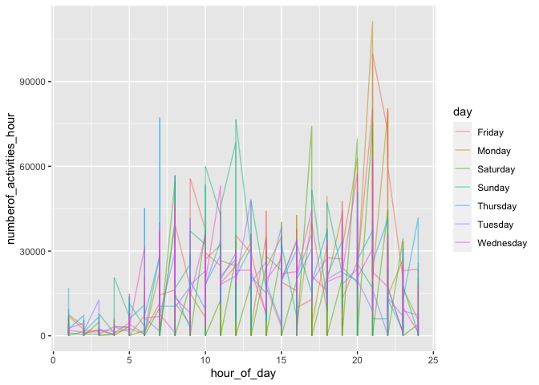

p8105\_hw3\_kh3074
================
KaiYu He(kh3074)
10-14-2021

``` r
library(tidyverse)
```

    ## ── Attaching packages ─────────────────────────────────────── tidyverse 1.3.1 ──

    ## ✓ ggplot2 3.3.5     ✓ purrr   0.3.4
    ## ✓ tibble  3.1.2     ✓ dplyr   1.0.7
    ## ✓ tidyr   1.1.3     ✓ stringr 1.4.0
    ## ✓ readr   2.0.1     ✓ forcats 0.5.1

    ## ── Conflicts ────────────────────────────────────────── tidyverse_conflicts() ──
    ## x dplyr::filter() masks stats::filter()
    ## x dplyr::lag()    masks stats::lag()

``` r
library(p8105.datasets)
```

# Problem 1

## 1,Load Data

``` r
data("instacart")
summary(instacart)
```

    ##     order_id         product_id    add_to_cart_order   reordered     
    ##  Min.   :      1   Min.   :    1   Min.   : 1.000    Min.   :0.0000  
    ##  1st Qu.: 843370   1st Qu.:13380   1st Qu.: 3.000    1st Qu.:0.0000  
    ##  Median :1701880   Median :25298   Median : 7.000    Median :1.0000  
    ##  Mean   :1706298   Mean   :25556   Mean   : 8.758    Mean   :0.5986  
    ##  3rd Qu.:2568023   3rd Qu.:37940   3rd Qu.:12.000    3rd Qu.:1.0000  
    ##  Max.   :3421070   Max.   :49688   Max.   :80.000    Max.   :1.0000  
    ##     user_id         eval_set          order_number      order_dow    
    ##  Min.   :     1   Length:1384617     Min.   :  4.00   Min.   :0.000  
    ##  1st Qu.: 51732   Class :character   1st Qu.:  6.00   1st Qu.:1.000  
    ##  Median :102933   Mode  :character   Median : 11.00   Median :3.000  
    ##  Mean   :103113                      Mean   : 17.09   Mean   :2.701  
    ##  3rd Qu.:154959                      3rd Qu.: 21.00   3rd Qu.:5.000  
    ##  Max.   :206209                      Max.   :100.00   Max.   :6.000  
    ##  order_hour_of_day days_since_prior_order product_name          aisle_id    
    ##  Min.   : 0.00     Min.   : 0.00          Length:1384617     Min.   :  1.0  
    ##  1st Qu.:10.00     1st Qu.: 7.00          Class :character   1st Qu.: 31.0  
    ##  Median :14.00     Median :15.00          Mode  :character   Median : 83.0  
    ##  Mean   :13.58     Mean   :17.07                             Mean   : 71.3  
    ##  3rd Qu.:17.00     3rd Qu.:30.00                             3rd Qu.:107.0  
    ##  Max.   :23.00     Max.   :30.00                             Max.   :134.0  
    ##  department_id      aisle            department       
    ##  Min.   : 1.00   Length:1384617     Length:1384617    
    ##  1st Qu.: 4.00   Class :character   Class :character  
    ##  Median : 8.00   Mode  :character   Mode  :character  
    ##  Mean   : 9.84                                        
    ##  3rd Qu.:16.00                                        
    ##  Max.   :21.00

### interpretation of the data

-   The ***instacart*** data has 1384617 rows of data with 15 columns of
    features.
-   The is an online grocery shopping data set, ***order\_id*** is the
    identifier for each order, ***prodect\_id*** is the product
    identifier, ***reordered*** equals 1 if the product is ordered by
    the user in the past, ***order\_dow*** is the day of the week on
    which the product was placed, ***days\_since\_prior\_order*** is
    days since the last order, capped at 30, NA if order\_number=1.  
-   Take the first line as an example, Bulgarian Yogurt was placed by
    user ‘112108’ from ‘dairy eggs’ department. This is not the first
    time the user buys this item.

### 2

``` r
instacart%>%
  count(aisle)%>% 
  arrange(desc(n))%>%
  head()%>%
  knitr::kable() #show the most 5 items ordered
```

| aisle                         |      n |
|:------------------------------|-------:|
| fresh vegetables              | 150609 |
| fresh fruits                  | 150473 |
| packaged vegetables fruits    |  78493 |
| yogurt                        |  55240 |
| packaged cheese               |  41699 |
| water seltzer sparkling water |  36617 |

-   There are 134 aisles in the data, accroding the data frame, fresh
    vegetable is the most ordered item.

### 3

``` r
instacart%>%
  count(aisle)%>%
  filter(n>10000)%>%
  mutate(aisle = fct_reorder(aisle,n))%>%
  ggplot(aes(x = n,y = aisle))+
  geom_point()
```

<!-- -->

### 4

``` r
instacart%>%
  filter( aisle == 'baking ingredients'|aisle == 'dog food care'|aisle == 'packaged vegetables fruits')%>%
  group_by(aisle,product_name)%>%
  summarize(
    n_obs = n()
  )%>%
  top_n(3)%>%
  knitr::kable()
```

    ## `summarise()` has grouped output by 'aisle'. You can override using the `.groups` argument.

    ## Selecting by n_obs

| aisle                      | product\_name                                 | n\_obs |
|:---------------------------|:----------------------------------------------|-------:|
| baking ingredients         | Cane Sugar                                    |    336 |
| baking ingredients         | Light Brown Sugar                             |    499 |
| baking ingredients         | Pure Baking Soda                              |    387 |
| dog food care              | Organix Chicken & Brown Rice Recipe           |     28 |
| dog food care              | Small Dog Biscuits                            |     26 |
| dog food care              | Snack Sticks Chicken & Rice Recipe Dog Treats |     30 |
| packaged vegetables fruits | Organic Baby Spinach                          |   9784 |
| packaged vegetables fruits | Organic Blueberries                           |   4966 |
| packaged vegetables fruits | Organic Raspberries                           |   5546 |

### 5

``` r
instacart%>%
  filter(product_name == 'Pink Lady Apples'|product_name == 'Coffee Ice Cream')%>%
  group_by(order_dow,product_name)%>%
  summarize(
    mean_hour_of_day = mean(order_hour_of_day)
  )%>%
  pivot_wider(
    names_from = product_name,
    values_from = mean_hour_of_day
  )%>%
  knitr::kable()
```

    ## `summarise()` has grouped output by 'order_dow'. You can override using the `.groups` argument.

| order\_dow | Coffee Ice Cream | Pink Lady Apples |
|-----------:|-----------------:|-----------------:|
|          0 |         13.77419 |         13.44118 |
|          1 |         14.31579 |         11.36000 |
|          2 |         15.38095 |         11.70213 |
|          3 |         15.31818 |         14.25000 |
|          4 |         15.21739 |         11.55172 |
|          5 |         12.26316 |         12.78431 |
|          6 |         13.83333 |         11.93750 |

# Problem 2

## 1,Load data

``` r
data("brfss_smart2010")

brfss_smart2010%>%
  janitor::clean_names()%>% #format the data to use appropriate variable names;
  filter(topic == 'Overall Health') #focus on the “Overall Health” topic
```

    ## # A tibble: 10,625 x 23
    ##     year locationabbr locationdesc  class  topic  question  response sample_size
    ##    <int> <chr>        <chr>         <chr>  <chr>  <chr>     <chr>          <int>
    ##  1  2010 AL           AL - Jeffers… Healt… Overa… How is y… Excelle…          94
    ##  2  2010 AL           AL - Jeffers… Healt… Overa… How is y… Very go…         148
    ##  3  2010 AL           AL - Jeffers… Healt… Overa… How is y… Good             208
    ##  4  2010 AL           AL - Jeffers… Healt… Overa… How is y… Fair             107
    ##  5  2010 AL           AL - Jeffers… Healt… Overa… How is y… Poor              45
    ##  6  2010 AL           AL - Mobile … Healt… Overa… How is y… Excelle…          91
    ##  7  2010 AL           AL - Mobile … Healt… Overa… How is y… Very go…         177
    ##  8  2010 AL           AL - Mobile … Healt… Overa… How is y… Good             224
    ##  9  2010 AL           AL - Mobile … Healt… Overa… How is y… Fair             120
    ## 10  2010 AL           AL - Mobile … Healt… Overa… How is y… Poor              66
    ## # … with 10,615 more rows, and 15 more variables: data_value <dbl>,
    ## #   confidence_limit_low <dbl>, confidence_limit_high <dbl>,
    ## #   display_order <int>, data_value_unit <chr>, data_value_type <chr>,
    ## #   data_value_footnote_symbol <chr>, data_value_footnote <chr>,
    ## #   data_source <chr>, class_id <chr>, topic_id <chr>, location_id <chr>,
    ## #   question_id <chr>, respid <chr>, geo_location <chr>

## 2,Data Cleaning

``` r
brfss_smart2010 = 
  brfss_smart2010%>%
  janitor::clean_names()%>% #format the data to use appropriate variable names;
  filter(topic == 'Overall Health')%>% #focus on the “Overall Health” topic
  filter(response == 'Excellent'|response == 'Very good'|response == 'Good'|response == 'Fair'|response == 'Poor')%>%
  #include only responses from “Excellent” to “Poor”
  mutate(rank = response)%>%
  mutate(rank = recode(rank,'Excellent' = 5,'Very good' = 4,'Good' = 3,'Fair' = 2, 'Poor' = 1))%>%
  mutate(response = as.factor(response))%>%
  mutate(response = fct_reorder(response,rank))%>% #organize responses as a factor taking levels ordered from “Poor” to “Excellent”
  select(-rank)
```

## 3

``` r
state_2002 = 
  brfss_smart2010%>%
  filter(year == 2002)%>%
  group_by(locationabbr)%>%
  rename('state_2002' = locationabbr)%>%
  summarize(locations_obversed = n()/5)%>% #Five levels for each location
  filter(locations_obversed >= 7)
```

-   According to the table, there are 6 states were observed at more
    than 7 locations.

``` r
state_2010 = 
  brfss_smart2010%>%
  filter(year == 2010)%>%
  group_by(locationabbr)%>%
  rename('state_2010' = locationabbr)%>%
  summarize(locations_obversed = n()/5)%>% #Five levels for each location
  filter(locations_obversed >= 7)
```

-   According to the table, there are 14 states were observed at more
    than 7 locations.

## 4

``` r
brfss_smart2010%>%
  filter(response == 'Excellent')%>%
  group_by(year,locationabbr)%>%
  summarize(mean_excellent_value = mean(data_value))%>%
  ggplot(aes(x = year,y = mean_excellent_value,color = locationabbr))+
  geom_line(alpha = 0.5)
```

    ## `summarise()` has grouped output by 'year'. You can override using the `.groups` argument.

    ## Warning: Removed 3 row(s) containing missing values (geom_path).

<!-- -->

## 5

``` r
brfss_smart2010%>%
  filter(year == 2006|year == 2010)%>%
  filter(locationabbr == 'NY')%>%
  group_by(year,response)%>%
  ggplot(aes(y = data_value,x = locationdesc,color = response))+
  geom_point()+
  coord_flip()+
  facet_grid(~year)
```

<!-- --> \#
Problem 3

## 1,Load and tidy data

``` r
accel = read_csv("accel_data.csv")
```

    ## Rows: 35 Columns: 1443

    ## ── Column specification ────────────────────────────────────────────────────────
    ## Delimiter: ","
    ## chr    (1): day
    ## dbl (1442): week, day_id, activity.1, activity.2, activity.3, activity.4, ac...

    ## 
    ## ℹ Use `spec()` to retrieve the full column specification for this data.
    ## ℹ Specify the column types or set `show_col_types = FALSE` to quiet this message.

``` r
accel_tidy = 
  accel%>%
  pivot_longer(
    activity.1:activity.1440,
    names_to = 'minute_of_day',
    values_to = 'number_of_activity' #merge the acctivity per minuter to a single column
  )%>%
  mutate(minute_of_day = str_replace(minute_of_day,'activity.',''))%>% 
  mutate(minute_of_day = as.numeric(minute_of_day)) # translate minute variable to numeric
accel_tidy
```

    ## # A tibble: 50,400 x 5
    ##     week day_id day    minute_of_day number_of_activity
    ##    <dbl>  <dbl> <chr>          <dbl>              <dbl>
    ##  1     1      1 Friday             1               88.4
    ##  2     1      1 Friday             2               82.2
    ##  3     1      1 Friday             3               64.4
    ##  4     1      1 Friday             4               70.0
    ##  5     1      1 Friday             5               75.0
    ##  6     1      1 Friday             6               66.3
    ##  7     1      1 Friday             7               53.8
    ##  8     1      1 Friday             8               47.8
    ##  9     1      1 Friday             9               55.5
    ## 10     1      1 Friday            10               43.0
    ## # … with 50,390 more rows

-   There are total 50400 rows of obs in the tidy dataset, which contain
    number of activities per minute(1440 per day) in 35 days.

## 2 Sum up

``` r
accel_tidy%>%
  group_by(day_id)%>%
  summarize(activities_per_day = sum(number_of_activity))%>%
  knitr::kable()
```

| day\_id | activities\_per\_day |
|--------:|---------------------:|
|       1 |            480542.62 |
|       2 |             78828.07 |
|       3 |            376254.00 |
|       4 |            631105.00 |
|       5 |            355923.64 |
|       6 |            307094.24 |
|       7 |            340115.01 |
|       8 |            568839.00 |
|       9 |            295431.00 |
|      10 |            607175.00 |
|      11 |            422018.00 |
|      12 |            474048.00 |
|      13 |            423245.00 |
|      14 |            440962.00 |
|      15 |            467420.00 |
|      16 |            685910.00 |
|      17 |            382928.00 |
|      18 |            467052.00 |
|      19 |            371230.00 |
|      20 |            381507.00 |
|      21 |            468869.00 |
|      22 |            154049.00 |
|      23 |            409450.00 |
|      24 |              1440.00 |
|      25 |            260617.00 |
|      26 |            340291.00 |
|      27 |            319568.00 |
|      28 |            434460.00 |
|      29 |            620860.00 |
|      30 |            389080.00 |
|      31 |              1440.00 |
|      32 |            138421.00 |
|      33 |            549658.00 |
|      34 |            367824.00 |
|      35 |            445366.00 |

``` r
accel_tidy%>%
  group_by(day_id)%>%
  summarize(total_number_activities = sum(number_of_activity))%>%
  ggplot(aes(x = day_id,y = total_number_activities))+
  geom_point()+
  geom_line()
```

<!-- --> -
From the table and the plot, we can tell that the total activity over
the day don’t have a clear trend, it’s more likely to be a white noise
sequence.

## 3 plot

``` r
# plot in minute
accel_tidy%>%
  mutate(day_id = as.character(day_id))%>%
  ggplot(aes(x = minute_of_day,y = number_of_activity,color = day_id))+
  geom_point(alpha = 0.5)+
  geom_line(alpha = 0.5)
```

<!-- -->

``` r
# plot in hour
accel_tidy%>%
  mutate(day_id = as.character(day_id))%>%
  mutate(hour_of_day = ceiling(minute_of_day/60))%>%
  group_by(day_id,hour_of_day)%>%
  summarize(
    numberof_activities_hour = sum(number_of_activity)
  )%>%
  ggplot(aes(x = hour_of_day, numberof_activities_hour ,color = day_id))+
  geom_point(alpha = 0.5)+
  geom_line(alpha = 0.5)
```

    ## `summarise()` has grouped output by 'day_id'. You can override using the `.groups` argument.

<!-- --> -
From the activities per day in minute and in hour, we can find out that,
activities before 5 am and realy stable, within 1\~4 pm is relatively
low. - number of activities in 8\~12 am is relatively high - 20\~22 pm
is the peak of activities for every day. - The curve in the plot fits
people’s daily routine very well。
